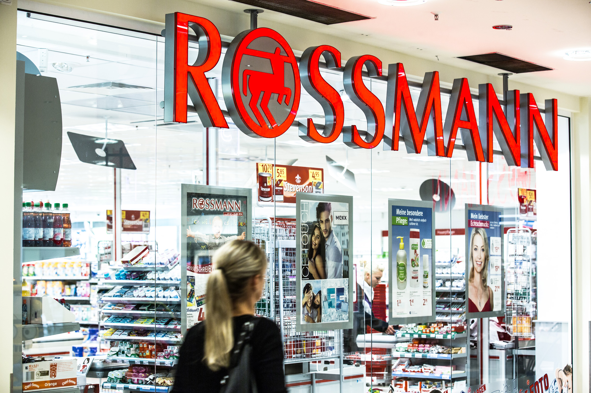
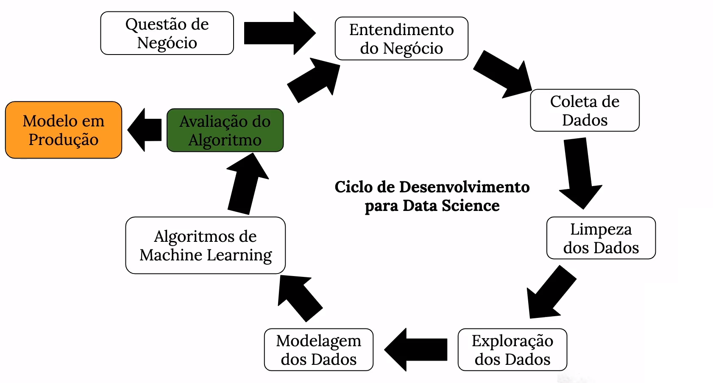
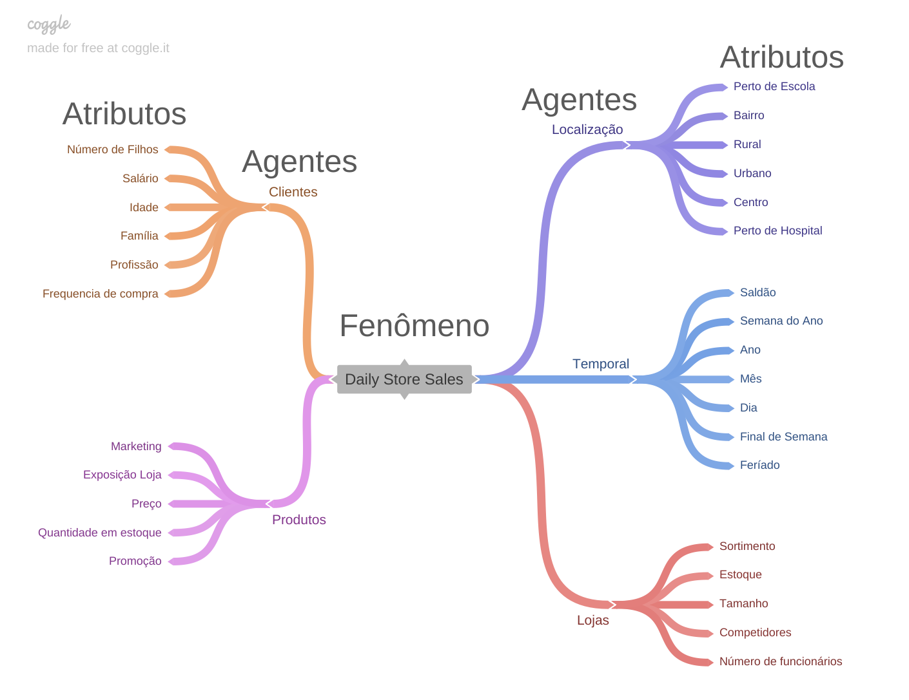
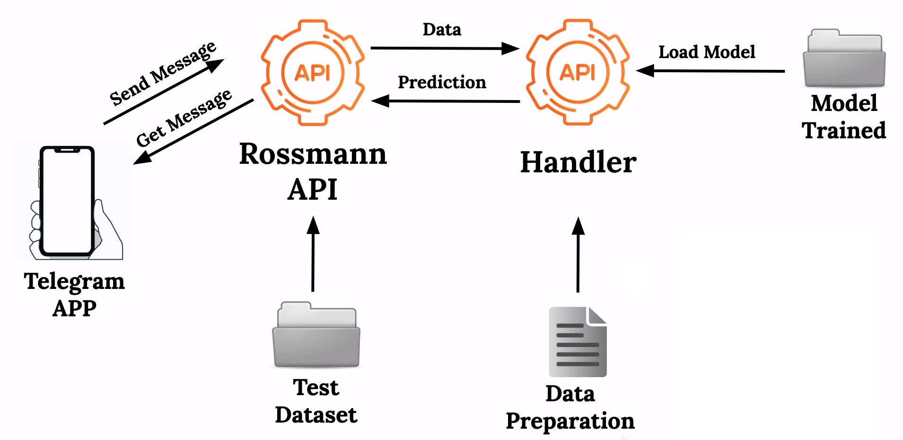

# Projeto Rossmann

## Problema de negócio.
Durante uma reunião de negócios entre os executivos da rede farmacêutica Rossmann, ficou definido que uma parcela total do orçamento da rede seria designada a reforma das lojas, com intuito de fornecer uma experiência melhor ao clientes e expandir os serviços oferecidos em algumas unidades.

O Chief Financial Officer da Rossmann ficou encarregado de escolher como será distribuido o orçamento e quanto o gerente de cada loja receberá. No entanto ele ainda não sabe qual será o orçamento disponível. Para resolver tal tarefa, o CFO entrou em contato com o gerente da equipe de dados, e pediu que fosse desenvolvido um algoritmo capaz de estimar o volume esperado de vendas de cada uma das lojas da Rossmann no próximo período de 6 semanas.

## Premissas do negócio
A Rossmann é uma das maiores redes farmacêuticas da Europa com mais de 50 mil empregados e 4000 lojas espalhadas por 8 países europeus. A Rossmann atua no modelo de varejo, oferecendo uma variedade de até 20 mil produtos dependendo do tamanho da loja e a localização.

Apesar de atuar no ramo farmacêutico, a Rossmann expandiu os seus negócios e hoje oferece uma ampla variedade de produtos, como cosméticos, produtos de higiene, vinhos, alimentos e até livros infantis. As vendas de cada loja são influenciadas por muitos fatores, incluindo promoções, competição, feriados estaduais e escolares, sazonalidade e localização. Abaixo estão listados os dados disponíveis que foram coletados nos últimos 2 anos.

    
<b>Dados referentas as lojas</b>

|   |   |
|---|---|
| **Store** | Id único para representar cada loja. |
| **StoreType** | Diferencia as lojas em 4 tipos: (a, b, c, d) |
| **Assortment** | Descreve a loja em uma de 3 diferentes classes:  (a - basic, b - extra, c - extended) |
| **Competition Distance** | Distância em metros da loja competidora mais próxima. |
| **CompetionOpen SinceMonth** | Mês em que o competidor mais próximo foi aberto. |
| **CompetitionOpen SinceYear** | Ano em que o competidor mais próximo foi aberto.  (ao combinarmos com o dado acima, obtemos a data de abertura do competidor mais próximo à loja em questão) |
| **Promo2** | Promoção recorrente que acontece em certos meses fixos do ano.  (0 - Loja não participa, 1 - Loja participa) |
| **Promo2Since Week** | Indica a semana do ano em que a loja começou a participar da Promo2. |
| **Promo2Since Year** | Indica o ano que a Promo2 foi implementada nessa loja (caso tenha sido). |
| **PromoInterval** | Indica os meses do ano em que a Promo2 fica ativa. (caso a loja participe) |

 

    
<b>Dados referentes as vendas</b>

|   |   |
|---|---|
| **Store** | Id único para representar cada loja |
| **DayOfWeek** | Número de 1 a 7 para representar o dia da semana.  (1 - Segunda-feira, … , 7 - Domingo) |
| **Date** | Data em que cada registro dessa tabela foi coletado. |
| **Sales** | Valor arrecadado no dia. |
| **Customers** | Número de clientes que compraram naquele dia. |
| **Open** | Indica se a loja estava aberta.  (0 - Fechada, 1 - Aberta) |
| **Promo** | Indica se naquele dia havia alguma promoção ativa.  (0 - Não, 1 - Sim) |
| **StateHoliday** | Indica se há um feriado estadual. Normalmente, as lojas são fechadas nessas ocasiões.  (a - Public holiday, b - Easter holiday, c - Christmas, 0 - None) |
| **SchoolHoliday** | Indica se a loja foi afetada pela fechamento das escolas.  (0 - Não, 1 - Sim) |

 

Durante o desenvolvimento do projeto foram feitas as seguintes considerações:

- Foram desconsiderados os dias que as lojas estavam fechadas, pois esses registros poderiam distorcer a média da variável `Sales`.
- A variável `Customers` não foi utilizado nas análises porque o seu valor não seria conhecido no ambiente de produção.
- Lojas sem informações dos competidores mais próximos tiveram o valor de `Competition Distance` fixado em 200_000 metros.

## Estratégia da solução.

Esse projeto foi realizado seguindo os passos do método CRISP-DS.

1. **Problema de Negócios:** Nesse primeira etapa do processo estamos interessados em entender o problema proposto e como as ferramentas de ciências de dados poderiam ser empregadas para criar uma solução.

2. **Entendimento de Negócio:** Nessa fase temos entender o tipo de negócio em que nossa solução será aplicada: quais são os principais KPI's? Qual é a raíz do problema para o qual estamos desenvolvendo a solução? Quem são os stakeholders? Quais são os recursos financeiros / computacionais diponíveis? As respostas a essas perguntas, nos ajudará a entender qual é o tipo de problema (classificação, regressão, time-series, ...) e o formato de entrega mais adequado.

3. **Descrição dos Dados:** Essa etapa é dedicada a entender os dados que descrevem o fenômeno, nesse caso o volume de vendas da rossmann, assim como fazer uma análise descritiva para entender o comportamento geral das features.

4. **Feature Engineering:** Nessa fase criamos um conjunto de hipóteses a partir do conhecimento adquirido nas etapas anteriores. Essas hipóteses nos auxilia no desenvolvimento de novas features, pois permitem que enxerguemos atributos relevantes ao problema de negócios que podem não estar disponíveis nas features originais.

5. **Exploração dos Dados:** A análise exploratória serve para medirmos o impacto das variáveis em relação a variável resposta; nessa etapa ganhamos experiência sobre o negócio, validamos hipóteses, geramos insights e adquirimos uma intuição de quais variáveis serão importantes para o modelo que será desenvolvido.

6. **Modelagem dos Dados:** Nessa etapa realizamos transformações nos dados para prepará-los para serem usados nos algoritmos de Machine Learning e fizemos o split entre treino, validação e teste. Aqui aplicamos encoders em variáveis categóricas, e fizemos a reescala ou normalização das variáveis numéricas.

7. **Feature Selection:** Nessa etapa utilizamos o algoritmo Boruta para selecionar as features que mais impactam a variável resposta e remover features que carregam o mesmo conteúdo de informação de outras (colineares). Além das selecionadas pela Boruta, foram incluídas features consideradas relevantes na análise exploratória de dados.

8. **Aplicação de Algoritmos de Machine Learning:** Nessa etapa foi testado 5 diferentes algoritmos de Machine Learning, os quais tiveram a sua performance comparadas com um modelo baseline para estimar o ganho de capacidade preditiva.

9. **Avaliação de Performance:** Nessa etapa fizemos a tradução de performance do modelo em resultado de negócio, isso é, convertemos as métricas de erro do algoritmo em performance financeira.

10. **Publicação da Solução:** Nessa etapa desenvolvemos um bot no telegram capaz de acessar as previsões de vendas das lojas.

## Top 3 Insights de dados.

Antes de realizar a análise exploratória eu desenvolvi um mapa mental para me ajudar a identificar quais agentes impactam o fenômeno de estudo. Esse mapa tem como objetivo me auxiliar na construção de hipóteses.

## Modelos de Machine Learning.

## O produto final do projeto.

<video width="800" height="500" controls>
  <source src="img/telebot_test.mp4" type="video/mp4">
</video>

## Conclusão.
## Próximos passos.